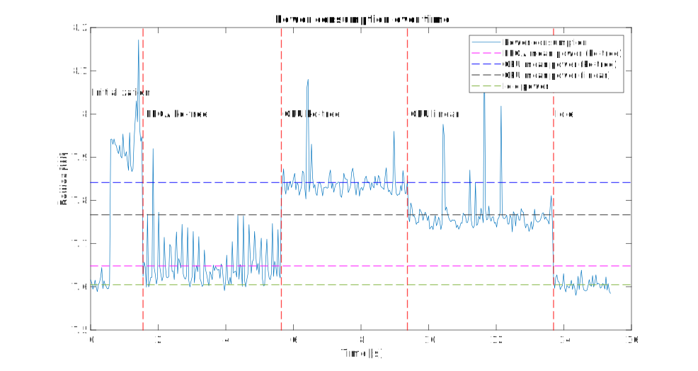

# kdtree_NN_search_FPGA_HLS_KRS
This is a ROS2 test package to prove a kd-tree nearest neighbor search algorithm implemented in FPGA using High Level Synthesis (HLS) and [Kria Robotics Stack (KRS)](https://xilinx.github.io/KRS/sphinx/build/html/index.html). The package is developed for the [Xilinx Kria K260 starter kit](https://www.amd.com/en/products/system-on-modules/kria/k26/kr260-robotics-starter-kit.html).

The intention of this package is to demonstrate the performance of the hardware implementation of the k-d tree nearest neighbor search algorithm on FPGA. This should be seen as a subpart of a larger system, where the FPGA is used to accelerate the computation of the nearest neighbor search algorithm, se below. The packages should be used af a subpart of a SLAM system, where the FPGA is used to accelerate the computation of the nearest neighbor search algorithm. The point cloud confidence mapper can be found [here](https://github.com/ThorKampOpstrup/pseudo_LiDAR_from_pc_pkg).

<div style="display: flex; justify-content: center;">
    <div style="margin: 10px;">
        
    </div>
</div>

[[ZED2I image](https://husarion.com/tutorials/ros-equipment/zed/)] | [[Xilinx Kria K260 starter kit image](https://www.amd.com/en/products/system-on-modules/kria/k26/kr260-robotics-starter-kit.html)]

## Installation
1. Follow the installation guide on the [KRS install](https://xilinx.github.io/KRS/sphinx/build/html/docs/install.html)
2. Clone this repository into your krs_ws workspace
```bash
cd krs_ws/src
git clone <ssh>
```
3. Build the workspace (assuming prior example build for necessary packages)
```bash
source <VITIS>
source <ROS2 HUMBLE>
export PATH="/usr/bin":$PATH  # FIXME: adjust path for CMake 3.5+
colcon build --merge-install
# make sure to "sudo ln -s ~/krs_ws/install/../acceleration/firmware/kr260/sysroots/aarch64-xilinx-linux/usr/lib/aarch64-linux-gnu/libpython3.10.so.1.0 /usr/lib/aarch64-linux-gnu/libpython3.10.so"
# or similar path
source install/setup.bash
colcon acceleration select kr260

colcon build --event-handlers console_direct+ --build-base=build-kr260-ubuntu --install-base=install-kr260-ubuntu --merge-install --mixin kr260 --packages-select kdtree_NN_search --cmake-args -DNOKERNELS=false
```
4. Transfer the generated output to the target, assuming "ssh" connection are already set up
```bash
 scp -r install-kr260-ubuntu/ <USERNAME>@<IP>:~/ros2_ws/
```

## Usage
1. Run the following command on the target
```bash
cd ~/ros2_ws
sudo su
source <ROS2 HUMBLE>
source install-kr260-ubuntu/setup.bash
# restart the daemon that manages the acceleration kernels
ros2 acceleration stop; ros2 acceleration start
ros2 acceleration select kdtree_NN_search

# run the node- this will print the nearest neighbor timings to the console
ros2 run kdtree_NN_search kdtree_NN_search
```

# Performance Summary

This section provides a summary of the performance metrics for the hardware implementation of k-d tree nearest neighbor search on FPGA.

## Metrics

| Clock Frequency | Parallel Searches | k-d Tree Nodes | Query Points | Time to Process             |
|-----------------|-------------------|----------------|--------------|-----------------------------|
| 200 MHz         | 10                | 21,000         | 1,000        | ≈ 42 ms|

## Details

- The implementation operates at a clock frequency of 200 MHz.
- It supports parallel searches, with up to 10 searches running concurrently.
- The k-d tree used in the search algorithm consists of 21,000 nodes.
- The system is tested with 1,000 query points.
- The processing time for the given configuration is approximately 42 milliseconds.

## Resource Utilization

| CLB LUTs | CLB Registers | CLB  | LUT (Logic) | LUT (Memory) | BRAM | URAM |
|----------|----------------|------|-------------|--------------|------|------|
| 18,541   | 27,035         | 4,292| 16,486      | 2,055        | 54   | 50   |
| 15.85%   | 11.54%         | 29.32%| 14.08%      | 3.57%        | 37.50%| 78.13%|

## Comparing with Software Implementation
The provided implementation successfully decreases the power consumption per point with 80% compared to the software implementation, while maintaining the same time to process the data. This is achieved by utilizing the parallel processing capabilities of the FPGA.
The test setup for the power measurements is as follows:

<div style="display: flex; justify-content: center;">
    <div style="margin: 10px;">
        
    </div>
    <div style="margin: 10px;">
        
    </div>
</div>

[Xilinx Kria K260 starter kit image](https://www.amd.com/en/products/system-on-modules/kria/k26/kr260-robotics-starter-kit.html)

|                            | FPGA kd-tree nn        | CPU kd-tree nn         | CPU linear nn          |
|----------------------------|------------------------|------------------------|------------------------|
| Energy per point [J/point] | 1.77 * 10<sup>-6</sup> | 8.81 * 10<sup>-6</sup> | 7.00 * 10<sup>-5</sup> |